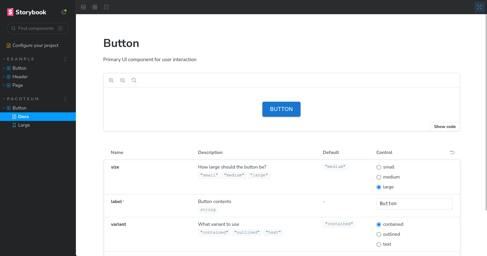

# Guia de criação

Template para monorepo de componentes React + Typescript + Material UI + Lerna + Jest + Storybook

<details>
<summary>Índice</summary>

- [Git](#git)
- [Package.json e Workspaces](#packagejson-e-workspaces)
- [EditorConfig](#editorconfig)
- [Prettier](#prettier)
- [Eslint](#eslint)
- [Typescript](#typescript)
- [Jest](#jest)
- [Lerna](#lerna)
- [Husky](#husky)
- [Lint-staged](#lint-staged)
- [Commitlint](#commitlint)
- [React](#react)
- [Material UI](#material-ui)
- [Commitizen](#commitizen)
- [Criando Pacotes](#criando-pacotes)
- [Storybook](#storybook)

</details>

:warning: **_Neste guia não entrarei em detalhes sobre propriedades dos arquivos de configuração, comandos e afins, para saber mais sobre isso acesse a documentação de cada ferramenta utilizada._**

:warning: **_Todos os comandos deste guia devem ser executados na raiz do projeto._**

## Getting started

Crie um diretório de sua escolha para nosso projeto. Para este guia vou criar o diretório `react-lib-components`.

### Git

:bulb: _O comando `git init` cria um novo repositório Git com a branch principal nomeada **master**(até a data de elaboração deste guia). Recentemente, muitos projetos e serviços, como o GitHub, mudaram o nome padrão da branch principal para **main** em resposta a considerações sobre a linguagem inclusiva. A palavra **master** pode evocar associações com a escravidão, e a mudança para **main** é um esforço para usar uma linguagem mais neutra e inclusiva na comunidade de tecnologia._

Inicie o repositório git, caso não o tenha feito, com comando abaixo.

```bash
git init -b main
```

#### .gitignore

Crie o arquivo `.gitignore` com comando abaixo.

```bash
printf '# Dependências\nnode_modules\n\n# Diretórios de build e distribuição\ndist\nbuild\nlib\nout\n\n# Arquivos de cache do compilador e da transpilação\n.tscache\n.turbo\n\n# Logs\nnpm-debug.log*\nyarn-debug.log*\nyarn-error.log*\npnpm-debug.log*\nlerna-debug.log*\n\n# Cobertura de testes\ncoverage\n.nyc_output\n\n# Diretórios e arquivos de configuração do editor\n.vscode\n.idea\n.sublime-workspace\n.sublime-project\n\n# Outros arquivos e diretórios\n.DS_Store\nThumbs.db\n' > .gitignore
```

<details>
<summary>Ou clique aqui para copiar e colar o conteúdo manualmente.</summary>
<br />

```txt
# Dependências
node_modules

# Diretórios de build e distribuição
dist
build
lib
out

# Arquivos de cache do compilador e da transpilação
.tscache
.turbo

# Logs
npm-debug.log*
yarn-debug.log*
yarn-error.log*
pnpm-debug.log*
lerna-debug.log*

# Cobertura de testes
coverage
.nyc_output

# Diretórios e arquivos de configuração do editor
.vscode
.idea
.sublime-workspace
.sublime-project

# Outros arquivos e diretórios
.DS_Store
Thumbs.db

```

</details>

### package.json e Workspaces

Em seguida, inicie o projeto npm dentro do diretório.

```bash
npm init -y
```

Vamos utilizar [`workspaces`](https://docs.npmjs.com/cli/v7/using-npm/workspaces), então vamos alterar o arquivo `package.json` criado anteriormente. Faça as alterações com o comando abaixo.

```bash
printf '{\n  "name": "react-lib-components",\n  "version": "0.0.0",\n  "private": true,\n  "workspaces": ["packages/*"],\n  "description": "Monorepo template for React component library + TypeScript + Material UI + Lerna"\n}\n' > package.json
```

<details>
<summary>Ou clique aqui para copiar e colar o conteúdo manualmente.</summary>
<br />

```json
{
  "name": "react-lib-components",
  "version": "0.0.0",
  "private": true,
  "workspaces": ["packages/*"],
  "description": "Monorepo template for React component library + TypeScript + Material UI + Lerna"
}
```

</details>

## Editorconfig

[Editorconfig](https://editorconfig.org/) é uma ferramenta de codificação que ajuda a manter estilos de codificação consistentes em diferentes editores e IDEs. Ele funciona através de um arquivo `.editorconfig` no repositório do projeto, definindo regras para indentação, espaços finais, conjunto de caracteres e outros estilos de código.

Crie o arquivo `.editorconfig` com o comando abaixo.

```bash
printf '# http://editorconfig.org\n\n# top-most EditorConfig file\nroot = true\n\n# Unix-style newlines with a newline ending every file\n[*]\ncharset = utf-8\nend_of_line = lf\ninsert_final_newline = true\ntrim_trailing_whitespace = true\n\n# Indentation override for js(x), ts(x) and vue files\n[*.{js,jsx,ts,tsx,vue}]\nindent_style = space\nindent_size = 2\ntrim_trailing_whitespace = true\ninsert_final_newline = true\n\n# Indentation override for css related files\n[*.{css,styl,scss,less,sass}]\nindent_size = 2\nindent_style = space\n\n# Indentation override for html files\n[*.html]\nindent_size = 2\nindent_style = space\n\n# Trailing space override for markdown file\n[*.md]\nindent_size = 2\nindent_style = space\ntrim_trailing_whitespace = false\n\n# Indentation override for config files\n[*.{json,yml}]\nindent_size = 2\nindent_style = space\n' > .editorconfig
```

<details>
<summary>Ou clique aqui para copiar e colar o conteúdo manualmente.</summary>
<br />

```yml
# http://editorconfig.org

# top-most EditorConfig file
root = true

# Unix-style newlines with a newline ending every file
[*]
charset = utf-8
end_of_line = lf
insert_final_newline = true
trim_trailing_whitespace = true

# Indentation override for js(x), ts(x) and vue files
[*.{js,jsx,ts,tsx,vue}]
indent_style = space
indent_size = 2
trim_trailing_whitespace = true
insert_final_newline = true

# Indentation override for css related files
[*.{css,styl,scss,less,sass}]
indent_size = 2
indent_style = space

# Indentation override for html files
[*.html]
indent_size = 2
indent_style = space

# Trailing space override for markdown file
[*.md]
indent_size = 2
indent_style = space
trim_trailing_whitespace = false

# Indentation override for config files
[*.{json,yml}]
indent_size = 2
indent_style = space

```

</details>

## Prettier

[Prettier](https://prettier.io/) é uma ferramenta de formatação de código que suporta várias linguagens, incluindo JavaScript, CSS e HTML. Ele padroniza a formatação do código, melhorando a consistência e legibilidade. Pode ser integrado a editores de código e fluxos de trabalho de CI/CD, automatizando a formatação e garantindo um estilo de código uniforme entre os desenvolvedores.

Instale a dependência.

```bash
npm i -D prettier
```

Crie o arquivo `.prettierrc.js` com o comando abaixo.

```bash
printf 'module.exports = {\n  arrowParens: "always",\n  useTabs: false,\n  printWidth: 79,\n  endOfLine: "lf",\n  tabWidth: 2,\n  semi: true,\n};\n' > .prettierrc.js
```

<details>
<summary>Ou clique aqui para copiar e colar o conteúdo manualmente.</summary>
<br />

```js
module.exports = {
  arrowParens: "always",
  useTabs: false,
  printWidth: 79,
  endOfLine: "lf",
  tabWidth: 2,
  semi: true,
};
```

</details>

## Eslint

[Eslint](https://eslint.org/) é uma ferramenta de análise de código estática para identificar padrões problemáticos encontrados em código JavaScript. Ele é amplamente configurável, permitindo a personalização de regras para garantir a qualidade e consistência do código. Também é comumente usado para fazer cumprir as diretrizes de estilo de codificação, trabalhando em conjunto com ferramentas como Prettier.

Instale as dependências com o comando abaixo.

```bash
npm i -D eslint eslint-config-prettier eslint-import-resolver-typescript eslint-plugin-import eslint-plugin-prettier  eslint-plugin-react @typescript-eslint/eslint-plugin @typescript-eslint/parser
```

Crie o arquivo `.eslintrc.js` com o comando abaixo.

```bash
printf 'module.exports = {\n  env: {\n    browser: true,\n    es2020: true,\n    jest: true,\n    node: true,\n  },\n  extends: [\n    "eslint:recommended",\n    "plugin:react/recommended",\n    "plugin:import/recommended",\n    "plugin:import/typescript",\n    "plugin:@typescript-eslint/recommended",\n    "prettier",\n  ],\n  parser: "@typescript-eslint/parser",\n  parserOptions: {\n    ecmaVersion: "latest",\n    sourceType: "module",\n  },\n  plugins: ["@typescript-eslint", "prettier", "react"],\n  rules: {\n    "prettier/prettier": "error",\n    "@typescript-eslint/no-var-requires": 0,\n    "react/react-in-jsx-scope": 0,\n    "import/order": [\n      "error",\n      {\n        groups: ["builtin", "external", "internal"],\n        pathGroups: [\n          {\n            pattern: "react",\n            group: "external",\n            position: "before",\n          },\n        ],\n        pathGroupsExcludedImportTypes: ["react"],\n        "newlines-between": "always",\n        alphabetize: {\n          order: "asc",\n          caseInsensitive: true,\n        },\n      },\n    ],\n  },\n  settings: {\n    "import/resolver": {\n      typescript: {},\n    },\n    react: {\n      version: "detect",\n    },\n  },\n};\n' > .eslintrc.js
```

<details>
<summary>Ou clique aqui para copiar e colar o conteúdo manualmente.</summary>
<br />

```js
module.exports = {
  env: {
    browser: true,
    es2020: true,
    jest: true,
    node: true,
  },
  extends: [
    "eslint:recommended",
    "plugin:react/recommended",
    "plugin:import/recommended",
    "plugin:import/typescript",
    "plugin:@typescript-eslint/recommended",
    "prettier",
  ],
  parser: "@typescript-eslint/parser",
  parserOptions: {
    ecmaVersion: "latest",
    sourceType: "module",
  },
  plugins: ["@typescript-eslint", "prettier", "react"],
  rules: {
    "prettier/prettier": "error",
    "@typescript-eslint/no-var-requires": 0,
    "react/react-in-jsx-scope": 0,
    "import/order": [
      "error",
      {
        groups: ["builtin", "external", "internal"],
        pathGroups: [
          {
            pattern: "react",
            group: "external",
            position: "before",
          },
        ],
        pathGroupsExcludedImportTypes: ["react"],
        "newlines-between": "always",
        alphabetize: {
          order: "asc",
          caseInsensitive: true,
        },
      },
    ],
  },
  settings: {
    "import/resolver": {
      typescript: {},
    },
    react: {
      version: "detect",
    },
  },
};
```

</details>

## Typescript

[TypeScript](https://www.typescriptlang.org/) é uma linguagem de programação desenvolvida pela Microsoft, um superset do JavaScript, que adiciona tipagem estática opcional. Isso permite que os desenvolvedores detectem erros mais facilmente e organizem o código de forma mais eficiente, especialmente em projetos grandes.

Instale a dependência com comando abaixo.

```bash
npm i -D typescript ts-node
```

Crie o arquivo `tsconfig.json` com o comando abaixo.

```bash
printf '{\n  "compilerOptions": {\n    "jsx": "react-jsx",\n    "skipLibCheck": true,\n    "module": "ESNext",\n    "moduleResolution": "Node",\n    "resolveJsonModule": true,\n    "allowSyntheticDefaultImports": true,\n    "esModuleInterop": true,\n    "forceConsistentCasingInFileNames": true,\n    "isolatedModules": true,\n    "noEmit": true,\n    "strict": true,\n    "noFallthroughCasesInSwitch": true,\n    "noImplicitAny": true,\n    "noUnusedParameters": true,\n    "strictNullChecks": true\n  },\n  "exclude": ["**/.*/", "**/build", "**/node_modules"]\n}\n' > tsconfig.json
```

<details>
<summary>Ou clique aqui para copiar e colar o conteúdo manualmente.</summary>
<br />

```json
{
  "compilerOptions": {
    "jsx": "react-jsx",
    "skipLibCheck": true,
    "module": "ESNext",
    "moduleResolution": "Node",
    "resolveJsonModule": true,
    "allowSyntheticDefaultImports": true,
    "esModuleInterop": true,
    "forceConsistentCasingInFileNames": true,
    "isolatedModules": true,
    "noEmit": true,
    "strict": true,
    "noFallthroughCasesInSwitch": true,
    "noImplicitAny": true,
    "noUnusedParameters": true,
    "strictNullChecks": true
  },
  "exclude": ["**/.*/", "**/build", "**/node_modules"]
}
```

</details>

Se após criar o `tsconfig.json` o editor acusar algum erro no arquivo, fique tranquilo, isso ocorre porque ainda não temos nenhum arquivo typescript no projeto.

## Jest

[Jest](https://jestjs.io/) é uma popular ferramenta de testes para JavaScript, conhecida por sua simplicidade e suporte a testes de snapshots. Oferece uma experiência de teste integrada com funções para criar, executar e estruturar testes, além de mockar objetos. É amplamente usada em aplicações React.

Instale as dependências com o comando abaixo.

```bash
npm i -D jest ts-jest jest-environment-jsdom @types/jest @testing-library/react @testing-library/jest-dom
```

Crie o arquivo `jest.config.ts` com o comando abaixo.

```bash
printf 'import type { Config } from "jest";\n\nconst config: Config = {\n  verbose: true,\n  preset: "ts-jest",\n  testEnvironment: "jsdom",\n  collectCoverage: true,\n};\n\nexport default config;\n' > jest.config.ts
```

<details>
<summary>Ou clique aqui para copiar e colar o conteúdo manualmente.</summary>
<br />

```ts
import type { Config } from "jest";

const config: Config = {
  verbose: true,
  preset: "ts-jest",
  testEnvironment: "jsdom",
  collectCoverage: true,
};

export default config;
```

</details>

## Lerna

[Lerna](https://lerna.js.org/) é uma ferramenta de gerenciamento de projetos JavaScript que otimiza o fluxo de trabalho em monorepos. Ela facilita a manutenção de múltiplos pacotes em um único repositório, automatizando tarefas como versionamento, publicação de pacotes e gerenciamento de dependências.

Instale a dependência com o comando abaixo.

```bash
npm i -D lerna
```

Crie o arquivo `lerna.json` com o comando abaixo.

:bulb: _Se você está utilizando outro gerenciador de pacotes que não o `npm`, confira a [documentação](https://lerna.js.org/docs/api-reference/configuration) para adaptar as suas necessidades._

```bash
printf '{\n  "$schema": "node_modules/lerna/schemas/lerna-schema.json",\n  "version": "independent",\n  "command": {\n    "publish": {\n      "conventionalCommits": true,\n      "message": "chore(release): version",\n      "exact": true\n    }\n  }\n}\n' > lerna.json
```

<details>
<summary>Ou clique aqui para copiar e colar o conteúdo manualmente.</summary>
<br />

```json
{
  "$schema": "node_modules/lerna/schemas/lerna-schema.json",
  "version": "independent",
  "command": {
    "publish": {
      "conventionalCommits": true,
      "message": "chore(release): version",
      "exact": true
    }
  }
}
```

</details>

### Scripts

Adicione os scripts necessários ao `package.json` com o comando abaixo.

```bash
npm pkg set scripts.build="lerna run build" scripts.test="lerna run test" scripts.clean="lerna run clean --parallel" scripts.version="lerna version --yes" scripts.publish:stable="lerna publish from-package --no-private --yes" scripts.publish:canary="lerna publish --canary --no-private --no-git-tag-version --no-push --yes"
```

## Husky

[Husky](https://typicode.github.io/husky/) é uma ferramenta de desenvolvimento para JavaScript que facilita a gestão de ganchos Git (Git hooks). Ela permite a configuração de scripts personalizados que são executados em eventos específicos do Git, como commit ou push, ajudando a manter a qualidade e a consistência do código.

Instale a dependência e inicialize a configuração do husky com o comando abaixo.

```bash
npm i -D husky && npx husky init
```

## Lint-staged

[Lint-staged](https://github.com/lint-staged/lint-staged) é uma ferramenta de desenvolvimento que executa linters em arquivos versionados pelo Git, mas que ainda não foram commitados. Ela melhora a eficiência ao focar apenas nos arquivos alterados, garantindo que o código atenda a padrões específicos antes dos commits.

Instale as dependências com o comando abaixo.

```bash
npm i -D lint-staged
```

Crie o arquivo `.lintstagedrc.js` com o comando abaixo.

```bash
printf 'const config = {\n  "*.{js,jsx,ts,tsx,json,md}": ["prettier --write"],\n  "*.{js,jsx,ts,tsx}": [\n    "eslint --fix --report-unused-disable-directives --max-warnings 0",\n  ],\n};\n\nexport default config;\n' > .lintstagedrc.js
```

<details>
<summary>Ou clique aqui para copiar e colar o conteúdo manualmente.</summary>
<br />

```js
const config = {
  "*.{js,jsx,ts,tsx,json,md}": ["prettier --write"],
  "*.{js,jsx,ts,tsx}": [
    "eslint --fix --report-unused-disable-directives --max-warnings 0",
  ],
};

export default config;
```

</details>

| Flag                                 | Descrição                                                                                                            |
| ------------------------------------ | -------------------------------------------------------------------------------------------------------------------- |
| `--fix`                              | Tenta corrigir automaticamente problemas encontrados que possuem correções disponíveis.                              |
| `--report-unused-disable-directives` | Reporta as diretivas `eslint-disable` que são desnecessárias porque as regras que elas desativavam não são violadas. |
| `--max-warnings`                     | Define o número máximo de avisos permitidos. Com `0`, até um único aviso resulta em falha de execução.               |

### Scripts

Altere o script do hook de pre-commit com o comando abaixo.

```bash
printf "npx lint-staged" > .husky/pre-commit
```

## Commitlint

[Commitlint](https://commitlint.js.org/) é uma ferramenta de desenvolvimento que ajuda a manter a consistência das mensagens de commit no Git. Ela verifica se as mensagens seguem um formato predefinido, baseado em convenções como [Conventional Commits](https://www.conventionalcommits.org/), aumentando a legibilidade e a organização do histórico de commits.

Instale as dependências com o comando abaixo.

```bash
npm i -D @commitlint/config-conventional @commitlint/cli
```

Crie o arquivo `commitlint.config.ts` com o comando abaixo.

```bash
printf 'import type { UserConfig } from "@commitlint/types";\n\nconst Configuration: UserConfig = {\n  extends: ["@commitlint/config-conventional"],\n};\n\nmodule.exports = Configuration;\n' > commitlint.config.ts
```

<details>
<summary>Ou clique aqui para copiar e colar o conteúdo manualmente.</summary>
<br />

```ts
import type { UserConfig } from "@commitlint/types";

const Configuration: UserConfig = {
  extends: ["@commitlint/config-conventional"],
};

module.exports = Configuration;
```

</details>

#### Scripts

Adicione o script do hook de commit-msg com o comando abaixo.

```bash
printf "npx --no -- commitlint --edit \$1" > .husky/commit-msg
```

## React

[React](https://reactjs.org/) é uma biblioteca JavaScript de código aberto para construir interfaces de usuário. Desenvolvida pelo Facebook, é usada para criar componentes reutilizáveis e gerenciar o estado em aplicações web de uma página (SPA). React é conhecido por seu modelo de componentes declarativos e pela eficiente atualização do DOM através de um algoritmo de reconciliação, o Virtual DOM.

Instale as dependências com o comando abaixo.

```bash
npm i -D react react-dom
```

## Material UI

[Material UI](https://mui.com/) é uma biblioteca de componentes React popular que implementa o Material Design do Google. Oferece uma vasta gama de componentes UI prontos para uso, como botões, caixas de diálogo, cards, entre outros, facilitando o desenvolvimento de interfaces atrativas e funcionais. Além disso, é altamente personalizável e otimizado para acessibilidade.

Instale as dependências com o comando abaixo.

```bash
npm i -D @mui/material @emotion/react @emotion/styled
```

## Criando Pacotes

:bulb: Para este guia irei manter todos os pacote no mesmo escopo, então todos os pacotes terão o `@react-lib-components` no início do nome.

### Estrutura dos pacotes

Vamos criar nosso primeiro pacote. Crie a pasta `packages` no diretório raiz do nosso projeto, ela será nosso workspace e todos os pacotes devem ficar dentro dela.

```bash
mkdir ./packages
```

### Pacote Um

Dentro da pasta `packages`, crie um novo diretório para o nosso pacote. Para este guia vou criar o diretório `pacote-um`.

```bash
mkdir ./packages/pacote-um
```

Nosso pacote precisa ter um `package.json`, então vamos criá-lo com o comando abaixo.

```bash
cd ./packages/pacote-um && npm init -y && cd ../..
```

Altere o `package.json` com o comando abaixo.

```bash
printf '{\n  "name": "@react-lib-components/pacote-um",\n  "version": "0.0.1",\n  "description": "Pacote um do template de monorepo",\n  "module": "./index.js",\n  "types": "./index.d.ts",\n  "files": ["./build"]\n}\n' > ./packages/pacote-um/package.json
```

<details>
<summary>Ou clique aqui para copiar e colar o conteúdo manualmente.</summary>
<br />

```json
{
  "name": "@react-lib-components/pacote-um",
  "version": "0.0.1",
  "description": "Pacote um do template de monorepo",
  "module": "./index.js",
  "types": "./index.d.ts",
  "files": ["./build"]
}
```

</details>

Agora crie o arquivo `tsconfig.json` específico para o **pacote-um**.

```bash
printf '{\n  "extends": "../../tsconfig.json",\n  "compilerOptions": {\n    "composite": true,\n    "module": "esnext",\n    "target": "es5",\n    "lib": ["DOM", "DOM.Iterable", "ESNext"],\n    "allowJs": true,\n    "declaration": true,\n    "noEmit": false,\n    "outDir": "build",\n    "rootDir": "./src"\n  },\n  "include": ["src/**/*"],\n  "exclude": ["**/*.stories.ts*", "**/*.test.ts*", "**/*.spec.ts*"]\n}\n' > ./packages/pacote-um/tsconfig.json
```

<details>
<summary>Ou clique aqui para copiar e colar o conteúdo manualmente.</summary>
<br />

```json
{
  "extends": "../../tsconfig.json",
  "compilerOptions": {
    "composite": true,
    "module": "esnext",
    "target": "es5",
    "lib": ["DOM", "DOM.Iterable", "ESNext"],
    "allowJs": true,
    "declaration": true,
    "noEmit": false,
    "outDir": "build",
    "rootDir": "./src"
  },
  "include": ["src/**/*"],
  "exclude": ["**/*.stories.ts*", "**/*.test.ts*", "**/*.spec.ts*"]
}
```

</details>

Atualmente, a estrutura de arquivos do nosso projeto deve estar como abaixo.

```txt
.
├─.husky
├─node_modules
├─packages
│   └─pacote-um
│       ├─package.json
│       └─tsconfig.json
├─.editorconfig
├─.eslintrc.js
├─.gitignore
├─.lintstagedrc.js
├─.prettierrc.js
├─commitlint.config.ts
├─jest.config.ts
├─lerna.json
├─package-lock.json
├─package.json
└─tsconfig.json
```

#### Componente Um

É possível ter vários componentes dentro de um único pacote, a escolha depende muito da necessidade do projeto. Para este guia vamos criar um único componente simples dentro do nosso pacote.

Instale o React e o Material UI como devDependencies do nosso pacote.

```bash
npm i && cd ./packages/pacote-um && npm i -D react react-dom @mui/material @emotion/react @emotion/styled && cd ../..
```

As peerDependencies garantem que o pacote consumidor tenha instalado as dependências corretas de que o pacote necessita para funcionar, sem forçar versões múltiplas das mesmas bibliotecas. Isso é vital para evitar conflitos de versão e inchaço desnecessário do node_modules. Após instalar as dependências, altere a propriedade `devDependencies` no `package.json` para `peerDependencies`, ficando como abaixo.

```json
{
  "name": "@react-lib-components/pacote-um",
  "version": "0.0.1",
  "description": "Pacote um do template de monorepo",
  "module": "./index.js",
  "types": "./index.d.ts",
  "files": ["./build"],
  "peerDependencies": {
    "@emotion/react": "^11.11.3",
    "@emotion/styled": "^11.11.0",
    "@mui/material": "^5.15.10",
    "react": "^18.2.0",
    "react-dom": "^18.2.0"
  }
}
```

Crie uma pasta `src` dentro da pasta `pacote-um` para armazenar todo o código fonte do nosso pacote.

```bash
mkdir ./packages/pacote-um/src
```

Dentro da pasta `./packages/pacote-um/src`, crie o arquivo `Typography.tsx` com o comando abaixo.

```bash
printf 'import { Typography as MuiTypography } from "@mui/material";\n\nexport interface TypographyProps {\n  /**\n   * Typography contents\n   */\n  label: string;\n  /**\n   * Optional click handler\n   */\n  onClick?: () => void;\n}\n\n/**\n * Typography Component for user interaction\n */\nconst Typography = ({ label, ...props }: TypographyProps) => {\n  return <MuiTypography {...props}>{label}</MuiTypography>;\n};\n\nexport default Typography;\n' > ./packages/pacote-um/src/Typography.tsx
```

<details>
<summary>Ou clique aqui para copiar e colar o conteúdo manualmente.</summary>
<br />

```tsx
import { Typography as MuiTypography } from "@mui/material";

export interface TypographyProps {
  /**
   * Typography contents
   */
  label: string;
  /**
   * Optional click handler
   */
  onClick?: () => void;
}

/**
 * Typography Component for user interaction
 */
const Typography = ({ label, ...props }: TypographyProps) => {
  return <MuiTypography {...props}>{label}</MuiTypography>;
};

export default Typography;
```

</details>

Crie o arquivo `index.ts`, dentro da pasta `src`, para centralizar as exportações do nosso pacote.

```bash
printf 'export { default as Typography } from "./Typography";\nexport * from "./Typography";\n' > ./packages/pacote-um/src/index.ts
```

<details>
<summary>Ou clique aqui para copiar e colar o conteúdo manualmente.</summary>
<br />

```ts
export { default as Typography } from "./Typography";
export * from "./Typography";
```

</details>

#### Testes com Jest

Agora vamos configurar o Jest dentro do **pacote-um**. Adicione o arquivo de configuração do Jest com o comando abaixo.

```bash
printf 'import type { Config } from "jest";\n\nimport { default as rootConfig } from "../../jest.config";\n\nconst config: Config = {\n  ...rootConfig,\n};\n\nexport default config;\n' > ./packages/pacote-um/jest.config.ts
```

<details>
<summary>Ou clique aqui para copiar e colar o conteúdo manualmente.</summary>
<br />

```ts
import type { Config } from "jest";

import { default as rootConfig } from "../../jest.config";

const config: Config = {
  ...rootConfig,
};

export default config;
```

</details>

Crie o arquivo `Typography.test.tsx` dentro da pasta `src` com o comando abaixo.

```bash
printf 'import React from "react";\n\nimport { render, screen } from "@testing-library/react";\n\nimport Typography from "./Typography";\n\nimport "@testing-library/jest-dom";\n\ndescribe("Typography Component", () => {\n  it("deve renderizar corretamente a texto", () => {\n    render(<Typography label="Minha tipografia" />);\n    expect(screen.getByText("Minha tipografia")).toBeTruthy();\n  });\n});\n' > ./packages/pacote-um/src/Typography.test.tsx
```

<details>
<summary>Ou clique aqui para copiar e colar o conteúdo manualmente.</summary>
<br />

```tsx
import React from "react";

import { render, screen } from "@testing-library/react";

import Typography from "./Typography";

import "@testing-library/jest-dom";

describe("Typography Component", () => {
  it("deve renderizar corretamente a texto", () => {
    render(<Typography label="Minha tipografia" />);
    expect(screen.getByText("Minha tipografia")).toBeTruthy();
  });
});
```

</details>

Adicione o script de teste ao `package.json`.

```bash
cd ./packages/pacote-um && npm pkg set scripts.test="jest" && cd ../..
```

### Pacote Dois

Agora vamos criar outro pacote e integrar os componentes entre si. Os passos são semelhantes aos do **pacote-um**.

Dentro da pasta `packages`, crie um novo diretório para o nosso pacote. Para este guia vou criar o diretório `pacote-dois`.

```bash
mkdir ./packages/pacote-dois
```

Crie o `package.json` com o comando abaixo.

```bash
cd ./packages/pacote-dois && npm init -y && cd ../..
```

Altere o `package.json` com o comando abaixo.

```bash
printf '{\n  "name": "@react-lib-components/pacote-dois",\n  "version": "0.0.1",\n  "description": "Pacote dois do template de monorepo",\n  "module": "./index.js",\n  "types": "./index.d.ts",\n  "files": ["./build"]\n}\n' > ./packages/pacote-dois/package.json
```

<details>
<summary>Ou clique aqui para copiar e colar o conteúdo manualmente.</summary>
<br />

```json
{
  "name": "@react-lib-components/pacote-dois",
  "version": "0.0.1",
  "description": "Pacote dois do template de monorepo",
  "module": "./index.js",
  "types": "./index.d.ts",
  "files": ["./build"]
}
```

</details>

Agora crie o arquivo `tsconfig.json` específico para o **pacote-dois**.

```bash
printf '{\n  "extends": "../../tsconfig.json",\n  "compilerOptions": {\n    "composite": true,\n    "module": "esnext",\n    "target": "es5",\n    "lib": ["DOM", "DOM.Iterable", "ESNext"],\n    "allowJs": true,\n    "declaration": true,\n    "noEmit": false,\n    "outDir": "build",\n    "rootDir": "./src"\n  },\n  "include": ["src/**/*"],\n  "exclude": ["**/*.stories.ts*", "**/*.test.ts*", "**/*.spec.ts*"]\n}\n' > ./packages/pacote-dois/tsconfig.json
```

<details>
<summary>Ou clique aqui para copiar e colar o conteúdo manualmente.</summary>
<br />

```json
{
  "extends": "../../tsconfig.json",
  "compilerOptions": {
    "composite": true,
    "module": "esnext",
    "target": "es5",
    "lib": ["DOM", "DOM.Iterable", "ESNext"],
    "allowJs": true,
    "declaration": true,
    "noEmit": false,
    "outDir": "build",
    "rootDir": "./src"
  },
  "include": ["src/**/*"],
  "exclude": ["**/*.stories.ts*", "**/*.test.ts*", "**/*.spec.ts*"]
}
```

</details>

Atualmente, a estrutura de arquivos do nosso projeto deve estar como abaixo.

```txt
.
├─.husky
├─node_modules
├─packages
│   ├─pacote-dois
│   │   ├─package.json
│   │   └─tsconfig.json
│   └─pacote-um
│       ├─src/
│       ├─jest.config.ts
│       ├─package.json
│       └─tsconfig.json
├─.editorconfig
├─.eslintrc.js
├─.gitignore
├─.lintstagedrc.js
├─.prettierrc.js
├─commitlint.config.ts
├─jest.config.ts
├─lerna.json
├─package-lock.json
├─package.json
└─tsconfig.json
```

#### Componente Dois

Instale o React e o Material UI como devDependencies do nosso pacote.

```bash
npm i && cd ./packages/pacote-dois && npm i -D react react-dom @mui/material @emotion/react @emotion/styled && cd ../..
```

Altere a propriedade `devDependencies` no `package.json` para `peerDependencies`, ficando como abaixo.

```json
{
  "name": "@react-lib-components/pacote-dois",
  "version": "0.0.1",
  "description": "Pacote dois do template de monorepo",
  "module": "./index.js",
  "types": "./index.d.ts",
  "files": ["./build"],
  "peerDependencies": {
    "@emotion/react": "^11.11.3",
    "@emotion/styled": "^11.11.0",
    "@mui/material": "^5.15.10",
    "react": "^18.2.0",
    "react-dom": "^18.2.0"
  }
}
```

Crie a pasta `src` na pasta `pacote-dois` para armazenar todo o código fonte do nosso pacote.

```bash
mkdir ./packages/pacote-dois/src
```

Dentro da pasta `./packages/pacote-dois/src`, crie o arquivo `Button.tsx` com o comando abaixo.

```bash
printf 'import { Button as MuiButton } from "@mui/material";\nimport { Typography } from "@react-lib-components/pacote-um";\n\nexport interface ButtonProps {\n  /**\n   * How large should the button be?\n   */\n  size?: "small" | "medium" | "large";\n  /**\n   * What variant to use\n   */\n  variant?: "contained" | "outlined" | "text";\n  /**\n   * Button contents\n   */\n  label: string;\n  /**\n   * Optional click handler\n   */\n  onClick?: () => void;\n}\n\n/**\n * Button Component for user interaction\n */\nconst Button = ({\n  size = "medium",\n  variant = "contained",\n  label,\n  ...props\n}: ButtonProps) => {\n  return (\n    <MuiButton size={size} variant={variant} {...props}>\n      <Typography label={label} />\n    </MuiButton>\n  );\n};\n\nexport default Button;\n' > ./packages/pacote-dois/src/Button.tsx
```

<details>
<summary>Ou clique aqui para copiar e colar o conteúdo manualmente.</summary>
<br />

```tsx
import { Button as MuiButton } from "@mui/material";
import { Typography } from "@react-lib-components/pacote-um";

export interface ButtonProps {
  /**
   * How large should the button be?
   */
  size?: "small" | "medium" | "large";
  /**
   * What variant to use
   */
  variant?: "contained" | "outlined" | "text";
  /**
   * Button contents
   */
  label: string;
  /**
   * Optional click handler
   */
  onClick?: () => void;
}

/**
 * Button Component for user interaction
 */
const Button = ({
  size = "medium",
  variant = "contained",
  label,
  ...props
}: ButtonProps) => {
  return (
    <MuiButton size={size} variant={variant} {...props}>
      <Typography label={label} />
    </MuiButton>
  );
};

export default Button;
```

</details>

#### Testes com Jest

Agora vamos configurar o Jest dentro do pacote. Adicione o arquivo de configuração do Jest ao `pacote-dois` com o comando abaixo.

```bash
printf 'import type { Config } from "jest";\n\nimport { default as rootConfig } from "../../jest.config";\n\nconst config: Config = {\n  ...rootConfig,\n};\n\nexport default config;\n' > ./packages/pacote-dois/jest.config.ts
```

<details>
<summary>Ou clique aqui para copiar e colar o conteúdo manualmente.</summary>
<br />

```ts
import type { Config } from "jest";

import { default as rootConfig } from "../../jest.config";

const config: Config = {
  ...rootConfig,
};

export default config;
```

</details>

Crie o arquivo `Button.test.tsx` com o comando abaixo.

```bash
printf 'import React from "react";\n\nimport { render, cleanup, screen } from "@testing-library/react";\n\nimport Button from "./Button";\n\nimport "@testing-library/jest-dom";\n\ndescribe("Button Component", () => {\n  afterEach(() => {\n    cleanup();\n  });\n\n  it("deve renderizar o Button com props padrão", () => {\n    render(<Button label="Botão Padrão" />);\n    expect(screen.getByText("Botão Padrão")).toBeTruthy();\n  });\n});\n' > ./packages/pacote-dois/src/Button.test.tsx
```

<details>
<summary>Ou clique aqui para copiar e colar o conteúdo manualmente.</summary>
<br />

```tsx
import React from "react";

import { render, cleanup, screen } from "@testing-library/react";

import Button from "./Button";

import "@testing-library/jest-dom";

describe("Button Component", () => {
  afterEach(() => {
    cleanup();
  });

  it("deve renderizar o Button com props padrão", () => {
    render(<Button label="Botão Padrão" />);
    expect(screen.getByText("Botão Padrão")).toBeTruthy();
  });
});
```

</details>

Adicione o script de teste ao `package.json`.

```bash
cd ./packages/pacote-dois && npm pkg set scripts.test="jest" && cd ../..
```

### Integração entre Pacotes

O componente `Button`(pacote-dois), que acabamos de criar, utiliza o componente `Typography`(pacote-um) dentro da sua estrutura, então precisamos adicionar o **pacote-um** como dependência do **pacote-dois**, para garantir o funcionamento correto dos componentes.

```bash
cd ./packages/pacote-dois && npm i @react-lib-components/pacote-um && cd ../..
```

Agora vamos configurar o nosso monorepo para integrar os pacotes entre si. Adicione o **baseUrl** e um **path mapping** ao nosso `tsconfig.json` principal, na raiz do projeto, ficando como abaixo.

```json
{
  "compilerOptions": {
    "jsx": "react-jsx",
    "skipLibCheck": true,
    "module": "ESNext",
    "moduleResolution": "Node",
    "resolveJsonModule": true,
    "allowSyntheticDefaultImports": true,
    "esModuleInterop": true,
    "forceConsistentCasingInFileNames": true,
    "isolatedModules": true,
    "noEmit": true,
    "strict": true,
    "noFallthroughCasesInSwitch": true,
    "noImplicitAny": true,
    "noUnusedParameters": true,
    "strictNullChecks": true,
    "baseUrl": ".",
    "paths": {
      "@react-lib-components/*": ["packages/*/src"]
    }
  },
  "exclude": ["**/.*/", "**/build", "**/node_modules"]
}
```

Agora adicione ao `tsconfig.json` do **pacote-dois** a referência ao **pacote-um**, ficando como abaixo.

```json
{
  "extends": "../../tsconfig.json",
  "compilerOptions": {
    "composite": true,
    "module": "esnext",
    "target": "es5",
    "lib": ["DOM", "DOM.Iterable", "ESNext"],
    "allowJs": true,
    "declaration": true,
    "noEmit": false,
    "outDir": "build",
    "rootDir": "./src"
  },
  "include": ["src/**/*"],
  "exclude": ["**/*.stories.ts*", "**/*.test.ts*", "**/*.spec.ts*"],
  "references": [
    {
      "path": "../pacote-um/tsconfig.json"
    }
  ]
}
```

Precisamos também adicionar um mapeamento para que o Jest consiga resolver as importações e dependências entre os pacotes. Adicione a propriedade `moduleNameMapper` ao arquivo `jest.config.ts` do **pacote-dois** conforme abaixo.

```ts
import type { Config } from "jest";

import { default as rootConfig } from "../../jest.config";

const config: Config = {
  ...rootConfig,
  moduleNameMapper: {
    "^@react-lib-components/pacote-um/(.*)$": "<rootDir>/../pacote-um/src/$1",
    "^@react-lib-components/pacote-um": "<rootDir>/../pacote-um/src",
  },
};

export default config;
```

### Executando os testes

Agora vamos executar os testes para ver se tudo está funcionando corretamente como esperado.

```bash
npm run test
```

## Storybook

[Storybook](https://storybook.js.org/) é uma ferramenta de desenvolvimento de interface do usuário (UI) para componentes de front-end. Ela permite aos desenvolvedores criar e visualizar componentes de UI isoladamente, facilitando o desenvolvimento e teste. Suporta frameworks como React, Vue, Angular e outros, tornando-se uma escolha popular para a documentação de componentes e construção de bibliotecas de design.

Inicialize a configuração do Storybook para React, jutamente com o builder do vite. :coffee: Pega um café que essa etapa demora um pouquinho.

```bash
npx storybook@latest init --builder vite --yes
```

Após instalado, o Storybook vai iniciar automaticamente, vamos dar um `Ctrl + C` para interromper a execussão por enquanto.

Vamos configurar o **Storybook** para enxergar nossas histórias nas pastas do nosso **Workspace**, e adicionar o mapeamento dos pacotes com o comando abaixo.

```bash
printf 'import type { StorybookConfig } from "@storybook/react-vite";\nimport type { UserConfig } from "vite";\n\nimport path, { join, dirname } from "path";\n\n/**\n * This function is used to resolve the absolute path of a package.\n * It is needed in projects that use Yarn PnP or are set up within a monorepo.\n */\nfunction getAbsolutePath(value: string): any {\n  return dirname(require.resolve(join(value, "package.json")));\n}\nconst config: StorybookConfig = {\n  stories: [\n    "../stories/**/*.mdx",\n    "../stories/**/*.stories.@(js|jsx|mjs|ts|tsx)",\n    "../packages/**/*.mdx",\n    "../packages/**/*.stories.@(js|jsx|mjs|ts|tsx)",\n  ],\n  addons: [\n    getAbsolutePath("@storybook/addon-links"),\n    getAbsolutePath("@storybook/addon-essentials"),\n    getAbsolutePath("@storybook/addon-onboarding"),\n    getAbsolutePath("@storybook/addon-interactions"),\n  ],\n  framework: {\n    name: getAbsolutePath("@storybook/react-vite"),\n    options: {},\n  },\n  docs: {\n    autodocs: "tag",\n  },\n  async viteFinal(config: UserConfig) {\n    // Garantir que config.resolve e config.resolve.alias existam\n    config.resolve = config.resolve || {};\n    config.resolve.alias = config.resolve.alias || {};\n\n    config.resolve.alias = {\n      ...config.resolve.alias,\n      "@react-lib-components/pacote-um": path.resolve(\n        __dirname,\n        "../packages/pacote-um/src",\n      ),\n      "@react-lib-components/pacote-dois": path.resolve(\n        __dirname,\n        "../packages/pacote-dois/src",\n      ),\n    };\n\n    return config;\n  },\n};\n\nexport default config;\n' > ./.storybook/main.ts
```

<details>
<summary>Ou clique aqui para copiar e colar o conteúdo manualmente.</summary>
<br />

```ts
import type { StorybookConfig } from "@storybook/react-vite";
import type { UserConfig } from "vite";

import path, { join, dirname } from "path";

/**
 * This function is used to resolve the absolute path of a package.
 * It is needed in projects that use Yarn PnP or are set up within a monorepo.
 */
function getAbsolutePath(value: string): any {
  return dirname(require.resolve(join(value, "package.json")));
}
const config: StorybookConfig = {
  stories: [
    "../stories/**/*.mdx",
    "../stories/**/*.stories.@(js|jsx|mjs|ts|tsx)",
    "../packages/**/*.mdx",
    "../packages/**/*.stories.@(js|jsx|mjs|ts|tsx)",
  ],
  addons: [
    getAbsolutePath("@storybook/addon-links"),
    getAbsolutePath("@storybook/addon-essentials"),
    getAbsolutePath("@storybook/addon-onboarding"),
    getAbsolutePath("@storybook/addon-interactions"),
  ],
  framework: {
    name: getAbsolutePath("@storybook/react-vite"),
    options: {},
  },
  docs: {
    autodocs: "tag",
  },
  async viteFinal(config: UserConfig) {
    // Garantir que config.resolve e config.resolve.alias existam
    config.resolve = config.resolve || {};
    config.resolve.alias = config.resolve.alias || {};

    config.resolve.alias = {
      ...config.resolve.alias,
      "@react-lib-components/pacote-um": path.resolve(
        __dirname,
        "../packages/pacote-um/src",
      ),
      "@react-lib-components/pacote-dois": path.resolve(
        __dirname,
        "../packages/pacote-dois/src",
      ),
    };

    return config;
  },
};

export default config;
```

</details>

### Stories

Agora vamos adicionar a nossa primeira história. Dentro da pasta `./packages/pacote-dois/src`, crie o arquivo `Button.stories.tsx` com o comando abaixo.

```bash
printf 'import type { Meta, StoryObj } from "@storybook/react";\n\nimport Button from "./Button";\n\nconst meta = {\n  title: "PacoteUm/Button",\n  component: Button,\n  parameters: {\n    layout: "centered",\n  },\n  tags: ["autodocs"],\n  argTypes: {},\n} satisfies Meta<typeof Button>;\n\nexport default meta;\ntype Story = StoryObj<typeof meta>;\n\nexport const Large: Story = {\n  args: {\n    size: "large",\n    label: "Button",\n    variant: "contained",\n  },\n};\n' > ./packages/pacote-dois/src/Button.stories.tsx
```

<details>
<summary>Ou clique aqui para copiar e colar o conteúdo manualmente.</summary>
<br />

```tsx
import type { Meta, StoryObj } from "@storybook/react";

import Button from "./Button";

const meta = {
  title: "PacoteUm/Button",
  component: Button,
  parameters: {
    layout: "centered",
  },
  tags: ["autodocs"],
  argTypes: {},
} satisfies Meta<typeof Button>;

export default meta;
type Story = StoryObj<typeof meta>;

export const Large: Story = {
  args: {
    size: "large",
    label: "Button",
    variant: "contained",
  },
};
```

</details>

Vamos testar nossas configurações. Inicie o storybook com o comando abaixo.

```bash
npm run storybook
```

O Storybook deve estar como na imagem abaixo, nosso Button dentro da seção `PACOTEUM`.



## Commitizen (Opcional)

[Commitizen](https://commitizen-tools.github.io/commitizen/) é uma ferramenta de linha de comando que padroniza as mensagens de commit do Git. Ele guia os desenvolvedores por um prompt de perguntas para criar um commit formatado de forma consistente e legível, facilitando a automação de versionamento e geração de changelogs. É amplamente usado em projetos que seguem as convenções de mensagens de commit, como o [Conventional Commits](https://www.conventionalcommits.org/).

Instale globalmente com o comando abaixo.

```bash
npm i -g commitizen
```

Inicialize a configuração do Commitizen com o comando abaixo.

```bash
npx commitizen init cz-conventional-changelog --npm --save-dev --exact
```

| Flag         | Descrição                                                                                                                              |
| ------------ | -------------------------------------------------------------------------------------------------------------------------------------- |
| `--npm`      | Especifica que o NPM deve ser usado para instalar o adaptador. Útil em ambientes com múltiplos gerenciadores de pacotes.               |
| `--save-dev` | Adiciona o adaptador como uma dependência de desenvolvimento no arquivo `package.json`. Não será incluído em produção.                 |
| `--exact`    | Garante a instalação da versão exata do adaptador, sem usar range de versões, para consistência entre os ambientes de desenvolvimento. |
